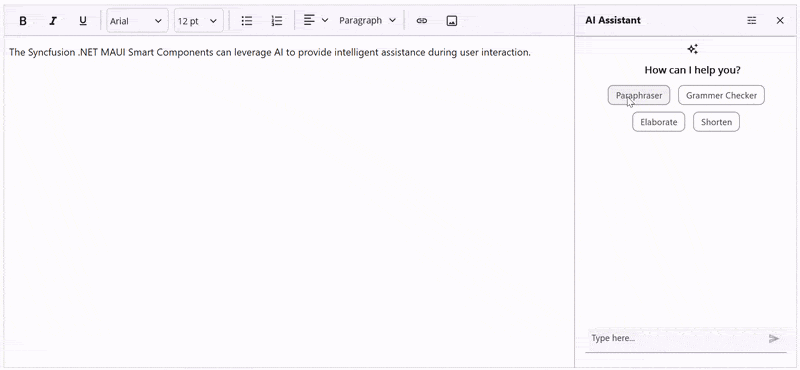

# Build an AI Powered RichTextEditor in .NET MAUI with Syncfusion AI AssistView

This repository demonstrates how to build an AI‑assisted writing experience in .NET MAUI by integrating Syncfusion’s RichTextEditor with the AI AssistView component. It showcases paraphrasing, tone adjustments, grammar checks, elaboration, and shortening powered by an Azure OpenAI backend.

## Key highlights

* Seamless RichTextEditor + AI AssistView integration
* Interactive suggestions with custom header template
* Platform‑aware UX: inline on Windows, dedicated page on Android/iOS
* Extensible, MVVM‑friendly architecture

## Features

This sample application showcases an AI-powered writing assistant with the following capabilities:

* Paraphraser – Rewrite content while preserving meaning with tone options:
    * Humanize (conversational)
    * Professional (business tone)
    * Simple (easy to understand)
    * Academic (scholarly style)
* Grammar Checker – Detect and correct grammatical errors.
* Elaborate – Expand content with additional details and context.
* Shorten – Condense text for concise communication.
* Accept Flow – Apply AI-generated suggestions back to the editor.

## Technologies Used

* .NET MAUI (net10.0) – Cross-platform framework for Android, iOS, macOS, and Windows.
* Syncfusion RichTextEditor – Rich text editing control.
* Syncfusion AI AssistView – AI-powered suggestion and interaction component.
* Azure OpenAI Services – Backend AI processing.

## Prerequisites

* .NET SDK compatible with .NET MAUI (net10.0 or later)
* Visual Studio 2022 with .NET MAUI workload installed.
* Azure OpenAI account with:
    * API endpoint
    * API key
    * Deployment/model name
Note: Syncfusion components may require a license key. 

## Quick Install

**Clone:**
```bash
git clone https://github.com/syncfusion/maui-ai-usecase-demos
cd AIPoweredWritingAssistant
```

**Configure Azure OpenAI credentials** in `Services/AzureBaseService.cs`:
```csharp
private const string endpoint      = "YOUR_AZURE_OPENAI_ENDPOINT";
private const string deploymentName = "YOUR_DEPLOYMENT_NAME";
private const string key           = "YOUR_API_KEY";
```

**Register Syncfusion license** in `MauiProgram.cs`:
```csharp
Syncfusion.Licensing.SyncfusionLicenseProvider.RegisterLicense("YOUR_LICENSE_KEY");
```

##  How It Works

### Navigation Flow

* Windows: AI AssistView appears inline when the "AI Assistant" button is clicked
* Android/iOS: Navigates to a dedicated 
AssistViewPage
 using Shell routing

### Suggestion Processing

* User selects a suggestion (e.g., "Paraphraser", "Grammar Checker").
* OnSuggestionTapCommand in AssistViewViewModel
handles the request.
* For "Paraphraser", follow-up tone options are presented (Humanize, Professional, etc.).
* AI service generates transformed content via Azure OpenAI.
* Response is displayed with an "Accept" suggestion.
* Accepting applies the content back to the RichTextEditor.

## Troubleshooting

### No AI Response

* Verify Azure OpenAI credentials (endpoint, key, deployment name).
* Check network connectivity.
* Ensure AzureAIService is properly instantiated and injected into AssistViewViewModel.
* Review exception handling in GetResultsFromAI.

### Suggestions Not Appearing

* Confirm Suggestions and AssistItems bindings in XAML
* Verify SuggestionItemSelectedCommand is bound to 
OnSuggestionTapCommand
* Check that _suggestions collection is populated in the ViewModel constructor

### Path Too Long Exception

* If you are facing a path too long exception when building this example project, close Visual Studio and rename the repository to a shorter name, then rebuild the project.

## Screenshot



## Documentation

* [Syncfusion .NET MAUI RichTextEditor Documentation](https://help.syncfusion.com/maui/rich-text-editor/getting-started)
* [Syncfusion .NET MAUI AI AssistView Documentation](https://help.syncfusion.com/maui/aiassistview/getting-started)
* [Azure OpenAI Service Documentation](https://learn.microsoft.com/en-us/azure/ai-foundry/?view=foundry-classic)