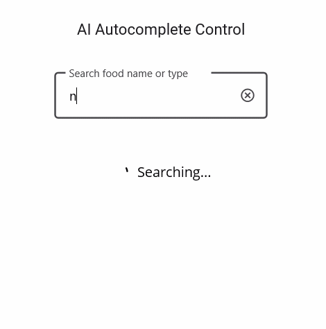

# Implementing AI-Powered Smart filter in .NET MAUI Autocomplete

This document will walk you through the implementation of an advanced filter functionality in the Syncfusion [.NET MAUI Autocomplete](https://help.syncfusion.com/cr/maui/Syncfusion.Maui.Inputs.SfAutocomplete.html) control. The example leverages the power of Azure OpenAI for an intelligent, AI-driven filter experience.

## Integrating Azure OpenAI with your .NET MAUI App

First, ensure you have access to [Azure OpenAI](https://learn.microsoft.com/en-us/azure/ai-foundry/openai/overview) and have created a deployment in the Azure portal.

If you don’t have access, please refer to the [create and deploy Azure OpenAI service](https://learn.microsoft.com/en-us/azure/ai-foundry/openai/how-to/create-resource?pivots=web-portal) guide to set up a new account.

Note down the deployment name, endpoint URL, and API key.

we’ll use the [Azure.AI.OpenAI](https://www.nuget.org/packages/Azure.AI.OpenAI/1.0.0-beta.12) NuGet package from the [NuGet Gallery](https://www.nuget.org/). So, before getting started, install the Azure.AI.OpenAI NuGet package in your .NET MAUI app.

In your base service class (AzureBaseService), initialize the OpenAIClient. Replace the Endpoint, DeploymentName, Key with actual values from your Azure OpenAI resource.

This creates a chat client using your endpoint, API key, and deployment name. It’s stored in the Client property for use in other methods.

ComboBoxAzureAIService use this Client to send prompts and receive completions.

In the `GetCompletion` method, we will construct the prompt and send it to the Azure OpenAI Service. The ChatHistory helps maintain context but is cleared for each new prompt in this implementation to ensure each filter is independent.

## Implementing custom filtering in .NET MAUI Autocomplete

The [.NET MAUI Autocomplete](https://help.syncfusion.com/cr/maui/Syncfusion.Maui.Inputs.SfAutocomplete.html) control allows you to apply custom filter logic to suggest items based on your specific filter criteria by utilizing the `FilterBehavior` property, which is the entry point for our smart filter logic.

**Step 1:** Let’s create a new business model to filter food names.

**Step 2:** Connecting the Custom Filter to Azure OpenAI

Implement the `GetMatchingItemsAsync` method from the interface. This method is the heart of the custom filter. It is invoked every time the text in the [Autocomplete](https://help.syncfusion.com/cr/maui/Syncfusion.Maui.Inputs.SfAutocomplete.html) control changes. 

The logic within [Autocomplete](https://help.syncfusion.com/cr/maui/Syncfusion.Maui.Inputs.SfAutocomplete.html) intelligently decides whether to perform an online AI filter based on the availability of Azure credentials.

To get accurate and structured results from the AI, we must provide a detailed prompt. This is constructed inside the 
`FilterItemsUsingAzureAI` method.

The `FilterItemsUsingAzureAI` method uses prompt engineering to instruct the AI on how to filter the results, including asking it to handle spelling mistakes and providing the response in a clean format.

**Step:3** Applying Custom Filtering to AutoComplete

Applying custom filtering to the [Autocomplete](https://help.syncfusion.com/cr/maui/Syncfusion.Maui.Inputs.SfAutocomplete.html) control by using the `AutocompleteFilterBehavior` property.

