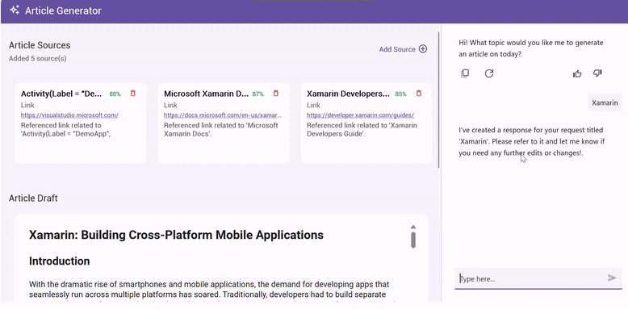

# Build a Source-Backed Article Workspace with .NET MAUI AI AssistView and Azure OpenAI 

A cross-platform .NET MAUI application that uses **Azure OpenAI** and the **Syncfusion AIAssistView** to generate structured, Markdown-formatted articles on any topic complete with auto-extracted resource links and a built-in Markdown viewer.

## Highlights

- Generates full GitHub-flavored Markdown (GFM) articles via Azure OpenAI GPT-4.1
- Renders Markdown content in-app using **Syncfusion MarkdownViewer**
- Extracts and displays reference links automatically from AI responses
- Manages a curated resource panel with add/delete/open-URL support
- Resilient AI client with exponential-backoff retry and offline fallback content
- MVVM architecture with dependency injection for clean, testable code
- Works across **iOS, Android, Windows, and macOS**

## Prerequisites

- .NET 10.0+
- Visual Studio 2022 (17.12+) or VS Code with .NET MAUI workload
- Syncfusion .NET MAUI AIAssistView and MarkdownViewer (Community/Commercial)
- Microsoft Semantic Kernel
- An active **Azure OpenAI** resource with a deployed model (e.g., `gpt-4.1`)

## Quick Install

**Clone:**
```bash
git clone https://github.com/syncfusion/maui-ai-usecase-demos
cd SmartArticleGenerator
```

**Configure Azure OpenAI credentials** in `Services/AzureBaseService.cs`:
```csharp
private const string endpoint      = "YOUR_AZURE_OPENAI_ENDPOINT";
private const string deploymentName = "YOUR_DEPLOYMENT_NAME";
private const string key           = "YOUR_API_KEY";
```

**Register Syncfusion license** in `MauiProgram.cs`:
```csharp
Syncfusion.Licensing.SyncfusionLicenseProvider.RegisterLicense("YOUR_LICENSE_KEY");
```

## Key Components (API)

| Member | Description |
|---|---|
| `ArticleViewModel.AssistViewRequestCommand` | Handles AIAssistView submission; triggers AI article generation |
| `ArticleViewModel.GetResult(inputQuery)` | Orchestrates the AI call, parses the response, and updates `HtmlContent` and `Resources` |
| `ArticleViewModel.GetUserAIPrompt(userPrompt)` | Builds a structured GFM prompt with word-count and references guidelines |
| `AzureAIService.GetResultsFromAI(userPrompt, aiPrompt, ct)` | Sends prompt to Azure OpenAI with up to 3 exponential-backoff retries; falls back to offline data |
| `ResponseParserService.ExtractResourcesFromResponse(content, query)` | Parses Markdown `[Title](URL)` and HTML `<a href>` links into `ResourceItem` list |
| `AzureBaseService.ValidateCredential()` | Validates endpoint/key format and tests a live call on startup |

## Why Use This

- **Productivity:** Generate structured, 2000–4000-word articles on any topic in seconds
- **Resilience:** Automatic retry with exponential backoff; graceful offline fallback prevents blank screens
- **Clean Architecture:** Full MVVM with DI makes every layer independently testable
- **Rich UI:** Native Markdown rendering on all platforms without a WebView dependency
- **Extensibility:** Swap the AI backend or add new resource providers with minimal changes

## Screenshot



## Resources

- Syncfusion AIAssistView docs: https://help.syncfusion.com/maui/aiassistview/getting-started
- Syncfusion MarkdownViewer docs: https://help.syncfusion.com/maui/markdownviewer/getting-started
- Microsoft Semantic Kernel: https://learn.microsoft.com/semantic-kernel/overview/
- Azure OpenAI Service: https://learn.microsoft.com/azure/ai-services/openai/overview
- .NET MAUI: https://dotnet.microsoft.com/apps/maui

## Support

For current Syncfusion customers, the newest version of Essential Studio is available from the [license and downloads page](https://www.syncfusion.com/account/downloads). If you are not yet a customer, you can try our [30-day free trial](https://www.syncfusion.com/downloads/maui) to check out these new features.

For questions, you can contact us through our [support forums](https://www.syncfusion.com/forums), [feedback portal](https://www.syncfusion.com/feedback/maui), or [support portal](https://support.syncfusion.com). We are always happy to assist you!

## Troubleshooting

**Path Too Long Exception**

If you are facing a path too long exception when building this example project, close Visual Studio and rename the repository to a shorter name, then rebuild the project.